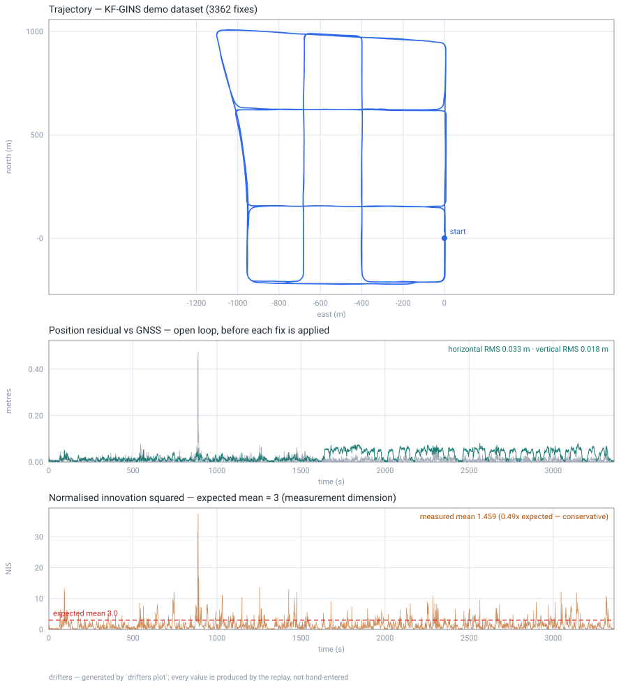

# drifters

A `no_std`, allocation-free GNSS/INS sensor fusion library in Rust. Fuses IMU,
GNSS and auxiliary sensors into position, velocity and attitude — the same code
on a Cortex-M microcontroller and on a workstation.

The architecture follows [KF-GINS](https://github.com/i2Nav-WHU/KF-GINS): a
loosely-coupled 21-state error-state Kalman filter over a local-level (NED)
strapdown mechanization, with feedback after every measurement. What differs is
that this is `no_std`, allocation-free, sans-IO, and measured on bare metal.

## Measured, not asserted

Every number here is produced by a test in this repository.

| | |
|---|---|
| **Accuracy** | **3.3 cm** horizontal, 1.8 cm vertical RMS over 57 minutes of real driving |
| | 683 k IMU samples at 200 Hz, 3 413 RTK fixes, replayed in 9.6 s |
| | per-axis bias below 1 mm |
| **Footprint** | **9.5 KiB** peak stack (15-state), 16.5 KiB (21-state), on Cortex-M4 |
| **Safety** | the data path links **zero** `core::panicking` symbols |
| **Dependencies** | **one** in the shipped stack: `libm` |
| **Tests** | 242, plus fuzzing and a bare-metal QEMU harness |

Accuracy is an open-loop check: the filter's predicted antenna position
*before* each fix is applied, so between fixes it is running on inertial dead
reckoning alone. Method and tolerances are in [docs/testing.md](docs/testing.md).



Regenerate it yourself with `drifters plot` — every value on the figure comes
from the replay, none are hand-entered. The bottom panel is the one to read
first: filter consistency means NIS *scattered about 3*, not NIS *small*.

## Status

**Working and validated:** core math, strapdown mechanization, 21-state ESKF,
loosely-coupled GNSS, auxiliary sensors (ZUPT, non-holonomic constraints,
odometer, barometric height, magnetometer heading), protobuf serialization,
bare-metal Cortex-M, KF-GINS dataset regression.

**In progress:** an equivariant filter (EqF) as a second estimator — Lie group
foundations are in, the filter itself is not. See [docs/eqf.md](docs/eqf.md).

**Not done:** timing on real silicon, and this has never run on a physical IMU.
Everything is dataset replay plus emulation. See
[docs/milestones.md](docs/milestones.md) for the full roadmap and what each
milestone actually proved.

## Layout

```
drifters-core      no_std, no alloc, deps: libm
                   fixed-size matrices, quaternions, WGS-84, frames, time
drifters-filter    no_std, no alloc — mechanization, 21-state ESKF, GinsEngine
drifters-proto     no_std — protobuf codecs (micropb), codegen needs no protoc
drifters-eqf       no_std — equivariant filter, in progress
drifters-interop   std ONLY — nav-types / gnss-rtk adapters, opt-in
drifters-cli       std — file-driven replay and validation
```

## Quick start

```bash
cargo add drifters-filter
```

```rust
use drifters_core::prelude::*;
use drifters_filter::{GinsEngine, GinsOptions};

let mut engine = GinsEngine::new(GinsOptions::default())?;

// Push samples in, pull state out. No allocation, no threads, no clock.
engine.add_imu(imu_sample)?;
engine.add_gnss(gnss_fix);
let solution = engine.nav_state();
```

Reproduce the accuracy number yourself — the dataset is not committed, so fetch
it first (67 MB, from the KF-GINS authors):

```bash
mkdir -p datasets/kf-gins && cd datasets/kf-gins && for f in kf-gins.yaml GNSS-RTK.txt Leador-A15.txt; do curl -fLO "https://raw.githubusercontent.com/i2Nav-WHU/KF-GINS/main/dataset/$f"; done
```

```bash
cargo test -p drifters-cli --release --test kf_gins_regression -- --nocapture
```

## Design notes

- **21 error states** — position, velocity, attitude, gyro bias, accel bias,
  gyro and accel scale factors. `--features reduced-state` drops the scale
  factors for 15 states, halving every matrix for 3 % accuracy.
- **Quaternions** for attitude (Hamilton, scalar-first). Euler angles are output
  only, never round-tripped through.
- **Two-sample coning and sculling** compensation with midpoint earth terms.
- **Joseph-form** covariance update, Cholesky solve rather than an explicit
  inverse, explicit re-symmetrisation.
- **Sans-IO.** The engine never allocates, blocks, reads a clock or touches a
  file. That is what lets the same code run inside an interrupt handler.
- **`f64` throughout**, deliberately — `f32` latitude costs 0.76 m per ULP
  against a 3.3 cm error budget. Reasoning in
  [docs/adr/0005](docs/adr/0005-scalar-type.md).

## Documentation

The docs carry the reasoning, including the parts that did not work.

- [design.md](docs/design.md) — architecture and resource budget
- [state-model.md](docs/state-model.md) — the 21-state error model, derived
- [frames.md](docs/frames.md) — coordinate frames and conventions
- [testing.md](docs/testing.md) — nine layers, and what each one can prove
- [milestones.md](docs/milestones.md) — roadmap and measured outcomes
- [adr/](docs/adr/) — decisions and why, including the ones reversed later

Two worth reading if you are evaluating this seriously:
[why an accelerometer bias and a tilt are the same measurement to a stationary
filter](docs/state-model.md), and [why `f32` was measured and
rejected](docs/adr/0005-scalar-type.md).

## Licence

MIT OR Apache-2.0, at your option.

`drifters-interop`'s `gnss-rtk-interop` feature is **not** default and links
AGPL-3.0 code; enabling it places the AGPL's obligations on the combined work.
`cargo deny` enforces that boundary in CI. See
[adr/0003](docs/adr/0003-interop-boundary.md).
