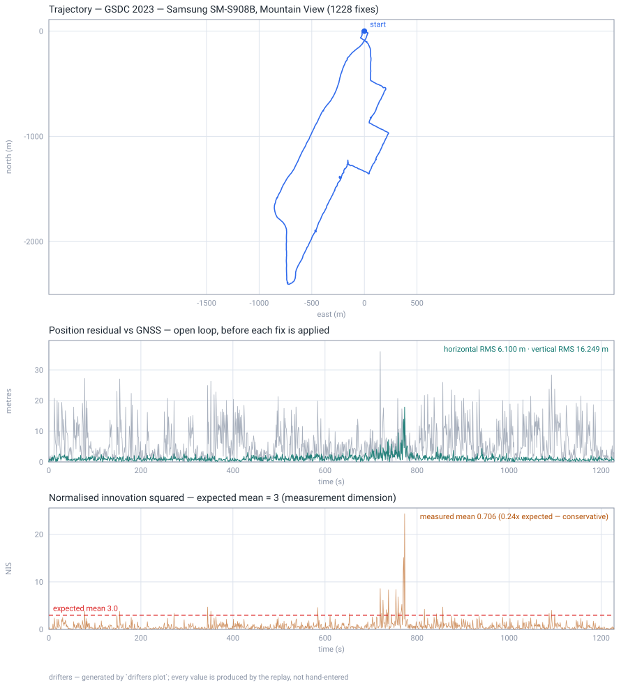

# drifters

A `no_std`, allocation-free GNSS/INS sensor fusion library in Rust. Fuses IMU,
GNSS and auxiliary sensors into position, velocity and attitude — the same code
on a Cortex-M microcontroller and on a workstation.

The architecture follows [KF-GINS](https://github.com/i2Nav-WHU/KF-GINS): a
loosely-coupled 21-state error-state Kalman filter over a local-level (NED)
strapdown mechanization, with feedback after every measurement. What differs is
that this is `no_std`, allocation-free, sans-IO, and measured on bare metal.

## Measured, not asserted

Every number here is produced by a test in this repository.

| | |
|---|---|
| **Accuracy** | **3.3 cm** horizontal, 1.8 cm vertical RMS over 57 minutes of real driving |
| | 683 k IMU samples at 200 Hz, 3 413 RTK fixes, replayed in 9.6 s |
| | per-axis bias below 1 mm |
| **Footprint** | **9.5 KiB** peak stack (15-state), 16.5 KiB (21-state), on Cortex-M4 |
| **Safety** | the data path links **zero** `core::panicking` symbols |
| **Dependencies** | **one** in the shipped stack: `libm` |
| **Tests** | 324, plus fuzzing and a bare-metal QEMU harness |

Accuracy is an open-loop check: the filter's predicted antenna position
*before* each fix is applied, so between fixes it is running on inertial dead
reckoning alone. Method and tolerances are in [docs/testing.md](docs/testing.md).


Regenerate it yourself with `drifters plot` — every value on the figure comes
from the replay, none are hand-entered. The bottom panel is the one to read
first: filter consistency means NIS *scattered about 3*, not NIS *small*.

### A second dataset, and an honest negative result

The KF-GINS numbers above come from a **tactical-grade** IMU with RTK GNSS. To
see where the filter stops helping, it was also run against a
[Google Smartphone Decimeter Challenge 2023](https://www.kaggle.com/competitions/smartphone-decimeter-2023)
trace — a Samsung SM-S908B in a car, 100 Hz phone IMU, ~6 m single-point GNSS —
which is the first dataset here carrying **survey-grade ground truth**, so this
is true position error rather than a prediction residual.

| | horizontal RMS | vertical RMS | horizontal max |
|---|---|---|---|
| phone GNSS (WLS) alone | 6.209 m | 17.980 m | 47.96 m |
| drifters, position-only aiding | 6.100 m | 16.249 m | 49.11 m |
| **drifters, + Doppler velocity** | **4.055 m** | **10.235 m** | **12.97 m** |
| | **−34.7 %** | **−43 %** | **−73 %** |

Position-only aiding gained almost nothing here — 1.7 % — and un-tuned it was
*worse* than GNSS alone. That was diagnosed rather than tuned away: heading is
weakly observable from position alone, so a phone gyro's drift injects error
faster than 1 Hz fixes remove it. Adding a **Doppler velocity solution**, solved
from the raw pseudorange rates already in the dataset, is what makes heading
observable — and it moved the result from 1.7 % to 34.7 %. Full diagnosis in
[docs/gsdc.md](docs/gsdc.md).



## Status

**Working and validated:** core math, strapdown mechanization, 21-state ESKF,
loosely-coupled GNSS, auxiliary sensors (ZUPT, non-holonomic constraints,
odometer, barometric height, magnetometer heading), protobuf serialization,
bare-metal Cortex-M, KF-GINS dataset regression.

**In progress:** an equivariant filter (EqF) as a second estimator — now running
end to end on the KF-GINS dataset via `drifters eqf`, and **self-calibrating its
GNSS antenna lever arm from a zero start to 2 mm on both horizontal axes**, which
is something the ESKF cannot do at all.

The head-to-head is a more interesting result than a win or a loss. As the paper
writes it, the EqF assumes a flat, non-rotating Earth — and on a tactical-grade
IMU that assumption *diverges*, as `t³`, at exactly Earth rate. Compensating the
input recovers five orders of magnitude and it converges to 1.5 cm. The gap to
the ESKF's 3.3 cm is therefore an **Earth model, not an estimator**, and the
honest venue for comparing the two is consumer-grade hardware, where the paper's
assumptions hold. Numbers and reasoning in [docs/eqf.md](docs/eqf.md).

That work also turned up
[six places the source paper cannot be taken literally](docs/eqf.md). A
transcription would have shipped all six; the last one was caught only because a
numerical Jacobian was moved off the identity element.

**Not done:** timing on real silicon, and this has never run on a physical IMU.
Everything is dataset replay plus emulation. See
[docs/milestones.md](docs/milestones.md) for the full roadmap and what each
milestone actually proved.

## Layout

```
drifters-core      no_std, no alloc, deps: libm
                   fixed-size matrices, quaternions, WGS-84, frames, time
drifters-filter    no_std, no alloc — mechanization, 21-state ESKF, GinsEngine
drifters-proto     no_std — protobuf codecs (micropb), codegen needs no protoc
drifters-eqf       no_std — equivariant filter (EqF), in progress
drifters-interop   std ONLY — nav-types / gnss-rtk adapters, opt-in
drifters-cli       std — file-driven replay and validation
```

## Quick start

```bash
cargo add drifters-filter
```

```rust
use drifters_core::prelude::*;
use drifters_filter::{GinsEngine, GinsOptions};

let mut engine = GinsEngine::new(GinsOptions::default())?;

// Push samples in, pull state out. No allocation, no threads, no clock.
engine.add_imu(imu_sample)?;
engine.add_gnss(gnss_fix);
let solution = engine.nav_state();
```

Reproduce the accuracy number yourself — the dataset is not committed, so fetch
it first (67 MB, from the KF-GINS authors):

```bash
mkdir -p datasets/kf-gins && cd datasets/kf-gins && for f in kf-gins.yaml GNSS-RTK.txt Leador-A15.txt; do curl -fLO "https://raw.githubusercontent.com/i2Nav-WHU/KF-GINS/main/dataset/$f"; done
```

```bash
cargo test -p drifters-cli --release --test kf_gins_regression -- --nocapture
```

## Design notes

- **21 error states** — position, velocity, attitude, gyro bias, accel bias,
  gyro and accel scale factors. `--features reduced-state` drops the scale
  factors for 15 states, halving every matrix for 3 % accuracy.
- **Quaternions** for attitude (Hamilton, scalar-first). Euler angles are output
  only, never round-tripped through.
- **Two-sample coning and sculling** compensation with midpoint earth terms.
- **Joseph-form** covariance update, Cholesky solve rather than an explicit
  inverse, explicit re-symmetrisation.
- **Sans-IO.** The engine never allocates, blocks, reads a clock or touches a
  file. That is what lets the same code run inside an interrupt handler.
- **NED navigation frame, FRD body frame** — the navigation-literature
  convention, not ROS's ENU/FLU. Conversion belongs at the boundary; reasoning
  in [docs/adr/0006](docs/adr/0006-frame-convention.md).
- **`f64` throughout**, deliberately — `f32` latitude costs 0.76 m per ULP
  against a 3.3 cm error budget. Reasoning in
  [docs/adr/0005](docs/adr/0005-scalar-type.md).

## Documentation

The docs carry the reasoning, including the parts that did not work.

- [design.md](docs/design.md) — architecture and resource budget
- [state-model.md](docs/state-model.md) — the 21-state error model, derived
- [frames.md](docs/frames.md) — coordinate frames and conventions
- [testing.md](docs/testing.md) — eleven layers, and what each one can prove
- [gsdc.md](docs/gsdc.md) — where the filter stops helping, and why
- [releasing.md](docs/releasing.md) — crates.io publish order and procedure
- [milestones.md](docs/milestones.md) — roadmap and measured outcomes
- [adr/](docs/adr/) — decisions and why, including the ones reversed later
- [papers/](docs/papers/) — the source papers: citations, DOIs and how to fetch them

Three worth reading if you are evaluating this seriously:
[why an accelerometer bias and a tilt are the same measurement to a stationary
filter](docs/state-model.md), [why `f32` was measured and
rejected](docs/adr/0005-scalar-type.md), and [why the frame is NED/FRD rather
than the ROS convention](docs/adr/0006-frame-convention.md).

## Licence

MIT OR Apache-2.0, at your option.

`drifters-interop`'s `gnss-rtk-interop` feature is **not** default and links
AGPL-3.0 code; enabling it places the AGPL's obligations on the combined work.
`cargo deny` enforces that boundary in CI. See
[adr/0003](docs/adr/0003-interop-boundary.md).
