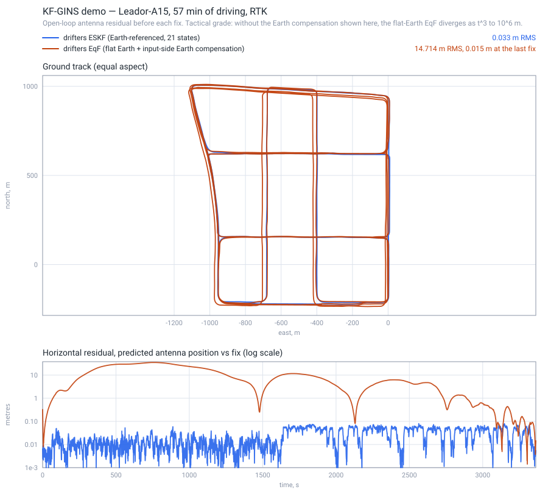
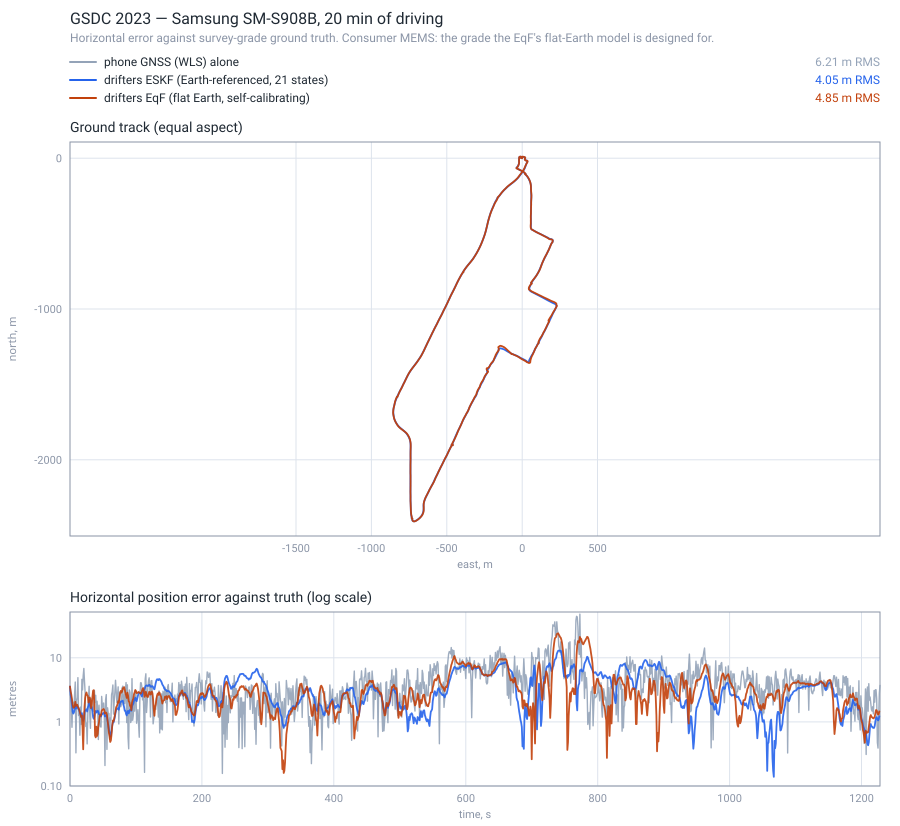

# drifters

A `no_std`, allocation-free **aided inertial navigation** library in Rust. It
estimates *extended pose* — position, velocity and attitude together — along
with the sensor errors that corrupt it, and runs the same code on a Cortex-M
microcontroller and on a workstation.

*Aided* rather than simply inertial, because only the IMU is: it alone drives
the propagation, and GNSS, barometric, magnetic and odometric aiding all enter
as corrections to it. *Extended pose* rather than pose, because velocity is a
state and not a by-product — it is the `v` in `SE₂(3)`, and the geometry of the
second estimator is built on it. In the usual shorthand, this is **GNSS/INS
integration**.

Two estimators over the same interface:

- an **error-state Kalman filter**, 21 states, following
  [KF-GINS](https://github.com/i2Nav-WHU/KF-GINS) — loosely coupled, over a
  local-level (NED) strapdown mechanization, with feedback after every
  measurement.
- an **equivariant filter**, 21 states, following Fornasier et al. (ICRA 2024).
  It linearises at a fixed origin rather than at the moving estimate, and
  spends six of its states on **self-calibration**: it recovers the GNSS antenna
  lever arm from a zero start, which the ESKF must be told.

What differs from the reference implementations is that this is `no_std`,
allocation-free, sans-IO, and measured on bare metal.

## Measured, not asserted

Every number here is produced by a test in this repository.

| | measured |
|---|---|
| **Accuracy** | **3.3 cm** horizontal, 1.8 cm vertical RMS over 57 minutes of real driving |
| | 683 k IMU samples at 200 Hz, 3 413 RTK fixes, replayed in 9.6 s |
| | per-axis bias below 1 mm |
| **Footprint** | **9.5 KiB** peak stack (15-state), 16.5 KiB (21-state), on Cortex-M4 |
| **Safety** | the data path links **zero** `core::panicking` symbols |
| **Dependencies** | **one** in the shipped stack: `libm` |
| **Estimators** | two, sharing one core: a 21-state **ESKF** and an **equivariant filter** |
| **Tests** | 336, plus fuzzing and a bare-metal QEMU harness |

Accuracy is an open-loop check: the filter's predicted antenna position
*before* each fix is applied, so between fixes it is running on inertial dead
reckoning alone. Method and tolerances are in [docs/testing.md](docs/testing.md).

## Two estimators, compared

The library ships an error-state Kalman filter and an
[equivariant filter](docs/eqf.md), over shared mechanization and shared Lie
group machinery. Both were run on the same two datasets, from the same inputs,
scored the same way.



**Tactical grade, and the interesting result is a loss.** The EqF as the paper
writes it assumes a flat, non-rotating Earth — and on an IMU this good that
*diverges*, as `t³`, reaching 10⁶ m. Solving the growth rate back gives
5.96 × 10⁻⁵ rad/s against an Earth rate of 7.29 × 10⁻⁵: it is the Earth turning,
and no state in the model can represent it, because the gyro's bias prior is
0.027 °/h and Earth rate is **557×** that.

Compensating the input — gyro by `R̂ᵀ(ω_ie + ω_en)`, accelerometer for Coriolis —
recovers five orders of magnitude and converges to **1.5 cm**, against the ESKF's
3.3 cm. So the gap here measures an **Earth model, not an estimator**. This
comparison is unfair by construction, and the honest venue is the one below.

The EqF also **self-calibrated the GNSS antenna lever arm from a zero start**,
against an ESKF that was handed the answer from config: `[+0.138, −0.303]` m
horizontally against a true `[+0.136, −0.301]` — 2 mm on both axes. That is a
capability the ESKF does not have at all.



**Consumer grade — where the flat-Earth assumption is the right one.** A phone
gyro drifts at ~20 °/h, so Earth rate sits *below* its noise floor rather than
557× above it. No Earth compensation is applied here; this is the paper's filter
as written.

Horizontal RMS against survey-grade truth, in metres. The process-noise scale
was fitted on **trace A only** and applied unchanged to three held-out traces
from the same phone, so B, C and D are out-of-sample. Bold marks the rows that
beat doing nothing.

| | A *(fitted)* | B | C | D |
|---|---|---|---|---|
| phone GNSS (WLS) alone | 6.21 | 3.78 | 2.82 | 4.03 |
| ESKF, consistent tuning ×95 | **5.71** | 5.51 | 3.41 | **3.55** |
| EqF, consistent tuning ×74 | **4.39** | 4.49 | **2.46** | **3.51** |
| ESKF, hand-picked ×300 | **4.06** | 4.11 | **2.09** | **3.32** |
| EqF, hand-picked ×300 | **4.85** | **3.22** | **2.21** | **3.49** |

The holdout was worth running, because it contradicts the headline this table
replaced.

**Trace A is the easy case, and fitting on it overstates everything.** Its GNSS
is the worst of the four by a wide margin — 6.21 m against 2.8 to 4.0 — which
leaves the most room for an IMU to help. The tuning fitted there does not
transfer: at ×95 and ×74, fusion is **worse than raw GNSS** on trace B for both
filters, and worse for the ESKF on C. Fitting on the most improvable trace and
generalising to harder ones is exactly what a holdout is for.

**The EqF still leads the ESKF, and that part does generalise.** At the A-fitted
tuning it is ahead on all four traces, by 23 %, 19 %, 28 % and 1 %. At ×300 the
picture is mixed, so the ranking depends on the criterion and both are shown
rather than whichever flatters the conclusion.

**The hand-picked ×300 generalises better than the consistent one**, helping on
seven of eight filter/trace combinations against five of eight, despite a mean
NIS of 0.44. Two explanations were possible: model error that extra process
noise absorbs, or heavy-tailed multipath innovations dragging a *mean* NIS
around. `drifters tune` now reports a **median** crossing too, which separates
them — and rejects the second. The innovations are genuinely heavy-tailed
(mean-to-median ratio 2.1–3.3 against the 1.27 a chi-squared gives), but
correcting for it moves the consistency point the *wrong way*: ×59 for the ESKF
and ≈×25 for the EqF, roughly doubling the distance to the accuracy optimum.
Unmodelled error is what is left, and it is large — the filters want five to
twelve times more process noise than consistency supports.

**The honest summary is modest.** On a phone, over one-second fix intervals,
inertial fusion buys between nothing and about 30 % depending on the trace, and
a tuning fitted on one trace can make it negative on another. The earlier "EqF
leads by 22 %" was a single-trace, fitted-on-test number and should not have
been stated that way.

Separately, the EqF's **generalised covariance union is actively harmful here**.
Sweeping its convergence rate α — the knob that replaces χ² rejection — gives
4.85 m at α = 0 and **27.4 m at α = 1**, monotonically worse. GCU inflates the
innovation covariance *along the innovation*, which is right when a large
innovation means a bad measurement and wrong when it means the filter has
drifted and the measurement is the only thing that can correct it. Sweeps in
[docs/eqf.md](docs/eqf.md) and [docs/gsdc.md](docs/gsdc.md).

Regenerate either figure yourself — every value on them comes from the replay,
none are hand-entered:

```bash
cargo run --release -p drifters-cli -- eqf --config datasets/kf-gins/kf-gins.yaml --earth-rate --compare docs/figures/kf-gins-comparison.svg
```

```bash
cargo run --release -p drifters-cli -- tune --dir datasets/gsdc2023
```

The per-filter diagnostic figures, with NIS, are still there: `drifters plot`
and `drifters gsdc --figure`. Filter consistency means NIS *scattered about 3*,
not NIS *small*.

### What made the phone result work: Doppler

The first attempt at that trace was a negative result. Position-only aiding
gained **1.7 %** over the phone's own GNSS, and un-tuned it was *worse* than
doing nothing.

That was diagnosed rather than tuned away. Heading is weakly observable from
position alone, so a phone gyro's drift injects error faster than 1 Hz fixes
remove it. Solving a **Doppler velocity** from the raw pseudorange rates already
in the dataset is what makes heading observable, and it moved the result from
1.7 % to 34.7 %. Both estimators above are given it, or the comparison would be
about inputs. Full diagnosis in [docs/gsdc.md](docs/gsdc.md).

## Status

**Working and validated:** core math, strapdown mechanization, 21-state ESKF,
loosely-coupled GNSS, auxiliary sensors (ZUPT, non-holonomic constraints,
odometer, barometric height, magnetometer heading), protobuf serialization,
bare-metal Cortex-M, KF-GINS dataset regression.

**In progress:** the equivariant filter. It runs end to end on both datasets
(see above) — symmetry group, lift, linearisation, group exponential, GCU and
the propagate/update loop, every Jacobian checked against a numerical one. Still
to do: a common backend trait, now that both estimators' shapes are known.

Building it from the papers rather than from notes turned up
[six places the source cannot be taken literally](docs/eqf.md#six-places-the-source-cannot-be-taken-literally).
A transcription would have shipped all six. The last was caught only after
moving a numerical Jacobian **off the identity element**, where `Â = I` had been
quietly making a body-frame rate and a global-frame rate look like the same
expression — it showed up in closed loop as a lever arm ten times more confident
than it was correct.

**Not done:** timing on real silicon, and this has never run on a physical IMU.
Everything is dataset replay plus emulation. See
[docs/milestones.md](docs/milestones.md) for the full roadmap and what each
milestone actually proved.

## Layout

```
drifters-core      no_std, no alloc, deps: libm
                   fixed-size matrices, quaternions, WGS-84, frames, time
drifters-filter    no_std, no alloc — mechanization, 21-state ESKF, GinsEngine
drifters-proto     no_std — protobuf codecs (micropb), codegen needs no protoc
drifters-eqf       no_std — equivariant filter, Lie groups, self-calibration
drifters-interop   std ONLY — nav-types / gnss-rtk adapters, opt-in
drifters-cli       std — replay, estimator comparison, NEES and tuning
```

## Quick start

```bash
cargo add drifters-filter
```

```rust
use drifters_core::prelude::*;
use drifters_filter::{GinsEngine, GinsOptions};

let mut engine = GinsEngine::new(GinsOptions::default())?;

// Push samples in, pull state out. No allocation, no threads, no clock.
engine.add_imu(imu_sample)?;
engine.add_gnss(gnss_fix);
let solution = engine.nav_state();
```

Reproduce the accuracy number yourself — no dataset is committed, so fetch it
first (67 MB, from the KF-GINS authors; the full index is
[docs/datasets.md](docs/datasets.md)):

```bash
mkdir -p datasets/kf-gins && cd datasets/kf-gins && for f in kf-gins.yaml GNSS-RTK.txt Leador-A15.txt; do curl -fLO "https://raw.githubusercontent.com/i2Nav-WHU/KF-GINS/main/dataset/$f"; done
```

```bash
cargo test -p drifters-cli --release --test kf_gins_regression -- --nocapture
```

## Design notes

- **21 error states** — position, velocity, attitude, gyro bias, accel bias,
  gyro and accel scale factors. `--features reduced-state` drops the scale
  factors for 15 states, halving every matrix for 3 % accuracy.
- **Quaternions** for attitude (Hamilton, scalar-first). Euler angles are output
  only, never round-tripped through.
- **Two-sample coning and sculling** compensation with midpoint earth terms.
- **Joseph-form** covariance update, Cholesky solve rather than an explicit
  inverse, explicit re-symmetrisation.
- **Sans-IO.** The engine never allocates, blocks, reads a clock or touches a
  file. That is what lets the same code run inside an interrupt handler.
- **NED navigation frame, FRD body frame** — the navigation-literature
  convention, not ROS's ENU/FLU. Conversion belongs at the boundary; reasoning
  in [docs/adr/0006](docs/adr/0006-frame-convention.md).
- **`f64` throughout**, deliberately — `f32` latitude costs 0.76 m per ULP
  against a 3.3 cm error budget. Reasoning in
  [docs/adr/0005](docs/adr/0005-scalar-type.md).

## Documentation

The docs carry the reasoning, including the parts that did not work.

- [design.md](docs/design.md) — architecture and resource budget
- [state-model.md](docs/state-model.md) — the 21-state error model, derived
- [frames.md](docs/frames.md) — coordinate frames and conventions
- [testing.md](docs/testing.md) — eleven layers, and what each one can prove
- [gsdc.md](docs/gsdc.md) — where the filter stops helping, and why
- [releasing.md](docs/releasing.md) — crates.io publish order and procedure
- [datasets.md](docs/datasets.md) — every external dataset and paper, and how to fetch it
- [milestones.md](docs/milestones.md) — roadmap and measured outcomes
- [adr/](docs/adr/) — decisions and why, including the ones reversed later
- [papers/](docs/papers/) — the source papers: citations, DOIs and how to fetch them

Three worth reading if you are evaluating this seriously:
[why an accelerometer bias and a tilt are the same measurement to a stationary
filter](docs/state-model.md), [why `f32` was measured and
rejected](docs/adr/0005-scalar-type.md), and [why the frame is NED/FRD rather
than the ROS convention](docs/adr/0006-frame-convention.md).

## Licence

MIT OR Apache-2.0, at your option.

`drifters-interop`'s `gnss-rtk-interop` feature is **not** default and links
AGPL-3.0 code; enabling it places the AGPL's obligations on the combined work.
`cargo deny` enforces that boundary in CI. See
[adr/0003](docs/adr/0003-interop-boundary.md).
